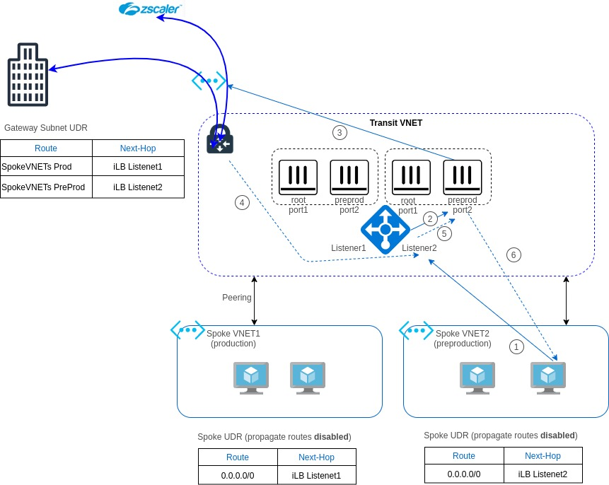

# Active/Active Pair of standalone FortiGates Utilizing Internal Load Balancers

## How to deploy

The FortiGate solution can be deployed using the Azure Portal or Azure Portal Wizard.

### Azure Portal

Azure Portal Wizard:

## Diagram

